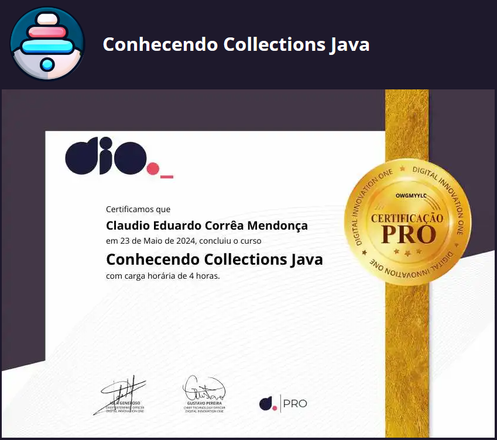

# DIO - Trilha Java Básico - Collection Framework API

|  |
|:--:|
| Trilha de Back-end Java do Santander Bootcamp 2024! Durante este desafio de projeto, explorei vários cenários referente ao curso "Collection Framework API Java" e é uma valiosa contribuição para a comunidade de desenvolvedores Java, fornecendo exemplos práticos e recursos educacionais relacionados à poderosa API de coleções da linguagem Java. |
|  |

## Collection Framework API

- Uma coleção (collection) é uma estrutura de dados que serve para agrupar muitos elementos em uma única unidade, estes elementos precisão ser Objetos.
- Uma Collection pode ter coleções homogêneas e heterogêneas, normalmente utilizamos coleções homogêneas de um tipo especifico.
- O núcleo principal das coleções é formado pelas interfaces da figura a abaixo, essas interfaces permitem manipular a coleção independente do nível de detalhe que elas representam.
- Temos quatro grandes tipos de coleções: `List` (lista), `Set` (conjunto), `Queue` (fila) e `Map` (mapa), a partir dessas interfaces, temos muitas subclasses concretas que implementam varias formas diferentes de se trabalhar com cada coleção.

| [](https://mermaid.live/edit#pako:eNqllEGTmjAUgP9KJnsFB7CuazoeVNiVrba71emhsYcIj5oRCQ1hlXX8743IbtVqeyDDMCH53vfeZMLb4kCEgAmOYrEOFkwqNHVnCdJj6tMhB8lksCiQiNBAxDEEiosE3Uu2grWQS8QT9Mhe2A9CSCSEjUzTRP7U-9rrj7yDJsvnPyVLF2fLIZeVbNo_rPSor3S6eQyVDXW7yF-lMawgUZn-6qI-_VPFG6XHQdC_EDCgI56pCr2OufQ5hxz-y3l0Aqe2ATIbyNsoSMJMT010T3tSsqJMewV50EUlSwiPmIdzZnjQuPCrLOyKyaff9GEIWe37F0p-pBPFgmVFuOeGT_RJciG5KtDzUSb3gmlET6vxLjBjOhFSQbg_pjfqLONnOmTZ4h_Al-p4TrHxOfZEpxIgewf0RnXjVBED6qGIxzG5iWAehLdGpqRYArmxLKuam2seqgVx0o0RiFjIcu_Y0K9tGNQ2uLUNXm3DqLZhXMNweAcxyzIXIrT_4yORKDPjr0AcK1Uf_ybsI6TZ0gg28ArkivFQt7rtPmCG1ULf2xkmehoyuZzhWbLTHMuVmBRJgImSORg4T0OmwOVMd7EVJhGLM72asgSTLd5g4rTuGpZtt2-tTrvTdjrtpoELTO4arZbdfH8-NHcGfhVCG-yGVY1m27lzrH0AhFz_xeNDKy47cpniexmwr2P3G8y8xCA) |
|:---:|
| [](https://mermaid.live/edit#pako:eNqdkstuwjAQRX_FGrYBJYRAcMWiEpVaqUjl0S6asDDxpIlw4sg24iX-vSZBArVlUy-sa8-ZO7bHR0gkR6CQCrlNMqYMWYzjktjRzHqz-lKsysjk8a3ZmUYTVi0ppamUZDQiL0UlsMDSaLsakVk0l8ogv0JN2uwPdh4tFOJPckraHfK0M1hybWWbLKJnprMFWwlc3kHeo9e8XCO3YF35DvZRO10BG6jFzY0v1zZ7gTY_zYWgrRRXCe872ii5RtpyXfei29ucm4x2q52TSCFVHbt1mP3fobFJBNN6jCk5v3YqS9PW-QFp163Mw2_Cu0H8wCLgQIGqYDm3PT6eE2IwmW1BDNRKztQ6hrg8WY5tjJzvywSoURt0YFNxZnCcM9v_AmjKhLa7FSuBHmEHNOwE4TDoem7Y6w3Cvu87sAfqex0rbWQQBH1v4PrhyYGDlNbB67jN8MPQHfb8YdcB5LmRatL8wfor1iU-64TzOU7f8SHOzA) |
|  |

<a href="https://data-flair.training/blogs/collection-framework-in-java/">Hierarchy of Collection Framework in Java </a>

- Todas as interfaces e classes são encontradas dentro do pacote (package) `java.util`.
- Embora a interface `Map` não ser filha direta da interface `Collection` ela também é considerada uma coleção devido a sua função.

| Modificador e Tipo               | Método                                | Descrição                                                                                          |
|----------------------------------|---------------------------------------|----------------------------------------------------------------------------------------------------|
| boolean                          | add(E e)                              | Assegura que esta coleção contém o elemento especificado (operação opcional).                      |
| boolean                          | addAll(Collection<? extends E> c)     | Adiciona todos os elementos da coleção especificada a esta coleção (operação opcional).            |
| void                             | clear(  )                               | Remove todos os elementos desta coleção (operação opcional).                                       |
| boolean                          | contains(Object o)                    | Retorna true se esta coleção contiver o elemento especificado.                                     |
| boolean                          | containsAll(Collection<?> c)          | Retorna true se esta coleção contiver todos os elementos na coleção especificada.                  |
| boolean                          | equals(Object o)                      | Compara o objeto especificado com esta coleção para igualdade.                                     |
| int                              | hashCode(  )                            | Retorna o valor do hash code para esta coleção.                                                    |
| boolean                          | isEmpty(  )                             | Retorna true se esta coleção não contiver elementos.                                               |
| Iterator<E>                      | iterator(  )                            | Retorna um iterador sobre os elementos desta coleção.                                              |
| default Stream<E>                | parallelStream(  )                      | Retorna um possivelmente paralelo Stream com esta coleção como sua fonte.                          |
| boolean                          | remove(Object o)                      | Remove uma única instância do elemento especificado desta coleção, se estiver presente (opcional). |
| boolean                          | removeAll(Collection<?> c)            | Remove todos os elementos desta coleção que também estão contidos na coleção especificada (opcional).|
| default boolean                  | removeIf(Predicate<? super E> filter) | Remove todos os elementos desta coleção que satisfazem o predicado dado.                           |
| boolean                          | retainAll(Collection<?> c)            | Retém apenas os elementos nesta coleção que estão contidos na coleção especificada (opcional).      |
| int                              | size(  )                                | Retorna o número de elementos nesta coleção.                                                       |
| default Spliterator<E>           | spliterator(  )                         | Cria um Spliterator sobre os elementos nesta coleção.                                              |
| default Stream<E>                | stream(  )                              | Retorna um Stream sequencial com esta coleção como sua fonte.                                      |
| Object[  ]                         | toArray(  )                             | Retorna um array contendo todos os elementos desta coleção.                                        |
| default <T> T[  ]                  | toArray(IntFunction<T[  ]> generator)   | Retorna um array contendo todos os elementos desta coleção, usando a função geradora fornecida.    |
| <T> T[  ]                          | toArray(T[  ] a)                        | Retorna um array contendo todos os elementos desta coleção; o tipo em tempo de execução do array retornado é o do array especificado. |

<a href="https://docs.oracle.com/en/java/javase/17/docs/api/java.base/java/util/Collection.html">Method Sumary Collection Interface</a>

---

### Exercicios e explicações:

- [ComparableX Comparator](collections-java-api/src/main/java/comparableXcomparator/README.md)
- [Generics Type](collections-java-api/src/main/java/generics/README.md)
- [List Interface](collections-java-api/src/main/java/list/README.md)
- [MAP](collections-java-api/src/main/java/Map/README.md)
- [SET](collections-java-api/src/main/java/Set/README.md)

---

### Referências:

[1] "Java Collections - Universidade Java." Universidade Java. Disponível em: http://www.universidadejava.com.br/java/java-collection/.

[2] "Java™ Platform, Standard Edition 17 API Specification - Interface Collection." Oracle. Disponível em: https://docs.oracle.com/en/java/javase/17/docs/api/java.base/java/util/Collection.html.

[3] "Java Comparator and Comparable - Baeldung." Baeldung. Disponível em: https://www.baeldung.com/java-comparator-comparable.

[4] "Java™ Platform, Standard Edition 17 API Specification - Class Collections." Oracle. Disponível em: https://docs.oracle.com/en/java/javase/17/docs/api/java.base/java/util/Collections.html.

---
## Certificados

- Conhecendo Collections Java

## Licença

Copyright © 2024 <a href="https://www.claudiomendonca.eng.br" target="_blank">ClaudioMendonca.eng.br</a> . 